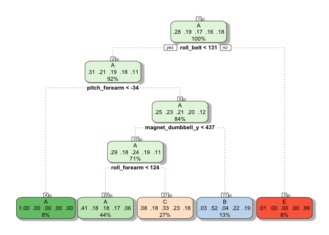

Predicting the excercise classe: ML Project
================
Gloria
4/20/2020

Background
==========

This project is based on data collected by activity trackers such as Jawbone Up, Nike FuelBand, and Fitbit. They inexpensively collect a large amount of data to quantify self-movement and find behavior patterns to improve health. This assignment is based on data from the [Human Activity Recognition (HAR) project](http://groupware.les.inf.puc-rio.br/har), which explores the development of context-aware systems with various purposes. This assignment particularly examines the data of weight lifting 6 participants with accelerometer sensors on their belts, forearms, arms, and dumbells. These participants were asked to perform barbell lifts in 5 different ways.

**The goal of this assigment** is to predict the manner in which the barbell lift was executed, which is identified by the outcome/dependent variable "classe", based on predictor/independent variables in the training set.

The **training data** for this assignment is to build machine learning (ML) algorithm and test: <https://d396qusza40orc.cloudfront.net/predmachlearn/pml-training.csv>

The **test data** with which the ML algorithm will be applied to determine the excercise class of every observation: <https://d396qusza40orc.cloudfront.net/predmachlearn/pml-testing.csv>

The background information used to build the ML algortihm for this assignment is: Velloso, E.; Bulling, A.; Gellersen, H.; Ugulino, W.; Fuks, H. [Qualitative Activity Recognition of Weight Lifting Exercises.](http://groupware.les.inf.puc-rio.br/public/papers/2013.Velloso.QAR-WLE.pdf) Proceedings of 4th International Conference in Cooperation with SIGCHI (Augmented Human '13) . Stuttgart, Germany: ACM SIGCHI, 2013.

Importing and cleaning data
===========================

``` r
#import csv file as train with all invalid elements identified as NA (NA, "", "#DIV/0!")
train=read.csv("https://d396qusza40orc.cloudfront.net/predmachlearn/pml-training.csv",
sep=",", header=T, na.strings=c("NA","#DIV/0!",""))
originalTrain=dim(train)
#remove variables with too many NA's
naIndex=colSums(sapply(train, is.na))
varValid=names(train[,naIndex==0])
train=train[,varValid]
cleanTrain=dim(train)
```

Prior to NA's removal, the train data set had 160 variables. After removing variables with too many NA's, the train set now has 60 variables.

Cross Validation
================

To verify that the prediction model is truly a predictors and not just overfitting the training data set, must seperate the training set into sub training and testing data sets. By doing this, multiple trial and error can be conducted without using te original test set. Here the training set will be further subdivided into 70% training and 30% test.

``` r
library(caret)
set.seed(1991)
inTrain=createDataPartition(y=train$classe, p=0.7, list=F)
training=train[inTrain,]
testing=train[-inTrain,]
```

With cross validation, the training and test set was divided into 13737 and 5885 observations respetively.

Expected out-of-sample error
============================

This corresponds to 1-accuracy, with accuracy being the probability of observations categorized correctly in the testing data set from the original training set data cross validated (aka out-of-sample data). This results in the expected error, the probability of observations categorized incorrectly in the same testing data set as the out-of-sample data. Based on probability theory concepts originally taught in inferential statistics of this specialization and more elaborated explanation given by one of the [course mentors](https://github.com/lgreski/datasciencectacontent/blob/master/markdown/pml-requiredModelAccuracy.md), the accuracy required for 95% confidence across 20 observations in the test data set is calculated via Sidak correction:

``` r
(1-0.05)^(1/20)
```

    ## [1] 0.9974386

Evaluating necessary variables
==============================

Based on background info provided by HAR (links in background), the following is known about the data set:

-   weight lifting excercise was performed by 6 male participants, ages 20-28, with little weight lifting experience using 1.25kg dumbbells

-   while performing the excercises, they were equiped with a special glove, armband, lumbar belt and dumbbell equiped with inertial measurement units (IMU) sensors that provide X/Y/Z axes acceleration, gyroscope and magnetometer data at a 45Hz sampling rate.

-   participants were tasked on performing 10 repitions of Unilateral Dumbbell Biceps Curls in 5 different ways:

    -   A= exactly according to specifications (correct)

-   B= throwing elbows to the front (incorrect)

-   C= lifting dumbbell only halfway (incorrect)

-   D= lowering dumbbell only halfway (incorrect)

-   E= throwing hips to the front (incorrect)

-   data collection format:

    -   feature extraction via sliding window approach (0.5-2.5 seconds long)

-   calculations within each window:

    -   Euler angles (roll, pitch, yaw); calculated features (mean, variance, standard deviation, max, min, amplitude, kurtosis, skewness)

-   accelerometer, gyroscope and magnetometer X/Y/Z readings

-   excercise performance label (A-E) stored in classe variable

With all this in mind, other non-essential variables like user name and window can be eliminated:

``` r
#identify variables with key words
impVar=names(training[,grep("arm|belt|dumbbell|classe", names(training))])
#remove non-essential variables from train data set
training=training[,impVar]
#apply same variable evaluation to trainig set 
testing=testing[,impVar]
```

By only keeping variables that are related to the sensors and classe, the number of predictors that will be used to develop a predictor model is 53.

Prediction Models
=================

Experiment with a couple of prediction models to determine which has the highest expected accuracy and lowest expected error for out-of-sample (testing set).

Model 1: Decision Tree
----------------------

The goal of this algorithm is to isolate the effect of each predictor variable by continuously splitting the data into subgroups until the groups reach homogeneity. The split groups are identified as "leaves" which are further split at "nodes", hence this technique being referred to as decision trees.

``` r
#building model using rpart method
desFit=train(classe ~ ., data=training, method="rpart")
#visualize decision tree
library(rattle)
fancyRpartPlot(desFit$finalModel, caption="")
```



``` r
#calculate accuracy of model 
desPreds=predict(desFit, newdata=testing)
confusionMatrix(desPreds, testing$classe)
```

    ## Confusion Matrix and Statistics
    ## 
    ##           Reference
    ## Prediction    A    B    C    D    E
    ##          A 1526  478  469  432  147
    ##          B   38  373   32  190  155
    ##          C  108  288  525  342  296
    ##          D    0    0    0    0    0
    ##          E    2    0    0    0  484
    ## 
    ## Overall Statistics
    ##                                          
    ##                Accuracy : 0.4941         
    ##                  95% CI : (0.4813, 0.507)
    ##     No Information Rate : 0.2845         
    ##     P-Value [Acc > NIR] : < 2.2e-16      
    ##                                          
    ##                   Kappa : 0.3389         
    ##                                          
    ##  Mcnemar's Test P-Value : NA             
    ## 
    ## Statistics by Class:
    ## 
    ##                      Class: A Class: B Class: C Class: D Class: E
    ## Sensitivity            0.9116  0.32748  0.51170   0.0000  0.44732
    ## Specificity            0.6376  0.91256  0.78720   1.0000  0.99958
    ## Pos Pred Value         0.5000  0.47335  0.33675      NaN  0.99588
    ## Neg Pred Value         0.9478  0.84972  0.88419   0.8362  0.88924
    ## Prevalence             0.2845  0.19354  0.17434   0.1638  0.18386
    ## Detection Rate         0.2593  0.06338  0.08921   0.0000  0.08224
    ## Detection Prevalence   0.5186  0.13390  0.26491   0.0000  0.08258
    ## Balanced Accuracy      0.7746  0.62002  0.64945   0.5000  0.72345

This model has an accuracy of 0.4941376 and an error of 1 - 0.4941376 = 0.5058624, indicating that this isn't the best model to use.

Model 2: Boosting
-----------------

The goal of this algorithm is to take possible weak predictors, re-weight them for strength emphasis, and then add them up. This is done by attempting to find a classifier that can seperate the variables, calculates the error rate of the classifier, upweights uncorrectly classified data points, checks, and repeats in many iterations until gets the lowest error rate possible.

``` r
#build model with gbm method
boostFit=train(classe ~ ., data=training, method="gbm", verbose=F)
#calculate accuracy of model 
boostPreds=predict(boostFit, newdata=testing)
confusionMatrix(boostPreds, testing$classe)
```

    ## Confusion Matrix and Statistics
    ## 
    ##           Reference
    ## Prediction    A    B    C    D    E
    ##          A 1649   34    1    0    4
    ##          B   22 1068   30    6    3
    ##          C    1   35  979   27   10
    ##          D    2    1   13  923   12
    ##          E    0    1    3    8 1053
    ## 
    ## Overall Statistics
    ##                                           
    ##                Accuracy : 0.9638          
    ##                  95% CI : (0.9587, 0.9684)
    ##     No Information Rate : 0.2845          
    ##     P-Value [Acc > NIR] : < 2e-16         
    ##                                           
    ##                   Kappa : 0.9542          
    ##                                           
    ##  Mcnemar's Test P-Value : 0.01076         
    ## 
    ## Statistics by Class:
    ## 
    ##                      Class: A Class: B Class: C Class: D Class: E
    ## Sensitivity            0.9851   0.9377   0.9542   0.9575   0.9732
    ## Specificity            0.9907   0.9871   0.9850   0.9943   0.9975
    ## Pos Pred Value         0.9769   0.9460   0.9306   0.9706   0.9887
    ## Neg Pred Value         0.9940   0.9851   0.9903   0.9917   0.9940
    ## Prevalence             0.2845   0.1935   0.1743   0.1638   0.1839
    ## Detection Rate         0.2802   0.1815   0.1664   0.1568   0.1789
    ## Detection Prevalence   0.2868   0.1918   0.1788   0.1616   0.1810
    ## Balanced Accuracy      0.9879   0.9624   0.9696   0.9759   0.9853

This model has an accuracy of 0.9638063 and an error of 1 - 0.9638063 = 0.0361937. This indicates a massive improvement from the decision tree, but still needs more optimization.

Model 3: Random forest
----------------------

The goal of this model is to build a classification tree that subsets variables for a potential split (bootstrapping) and then averages/votes the tree results to get a new prediction for the outcome. This is one of the most popular ones, but can lead to overfitting without cross validation.

``` r
#parallel processing configuration
library(parallel); library(doParallel)
cluster=makeCluster(detectCores()-1)
registerDoParallel(cluster)
#creating trainControl object 
rfControl=trainControl(method="cv", number=5, allowParallel=T)
#designate classe to y and all other variables to x for easier model code
x=training[,-53]; y=training[,53]
#create model 
rfFit=train(x, y, data=training, trControl=rfControl)
#deregister parallel processing cluster
stopCluster(cluster)
registerDoSEQ()
#calculate accuracy of model 
rfPreds=predict(rfFit, newdata=testing)
confusionMatrix(rfPreds, testing$classe)
```

    ## Confusion Matrix and Statistics
    ## 
    ##           Reference
    ## Prediction    A    B    C    D    E
    ##          A 1674    5    0    0    0
    ##          B    0 1131    6    0    0
    ##          C    0    3 1019   15    1
    ##          D    0    0    1  947    2
    ##          E    0    0    0    2 1079
    ## 
    ## Overall Statistics
    ##                                           
    ##                Accuracy : 0.9941          
    ##                  95% CI : (0.9917, 0.9959)
    ##     No Information Rate : 0.2845          
    ##     P-Value [Acc > NIR] : < 2.2e-16       
    ##                                           
    ##                   Kappa : 0.9925          
    ##                                           
    ##  Mcnemar's Test P-Value : NA              
    ## 
    ## Statistics by Class:
    ## 
    ##                      Class: A Class: B Class: C Class: D Class: E
    ## Sensitivity            1.0000   0.9930   0.9932   0.9824   0.9972
    ## Specificity            0.9988   0.9987   0.9961   0.9994   0.9996
    ## Pos Pred Value         0.9970   0.9947   0.9817   0.9968   0.9981
    ## Neg Pred Value         1.0000   0.9983   0.9986   0.9966   0.9994
    ## Prevalence             0.2845   0.1935   0.1743   0.1638   0.1839
    ## Detection Rate         0.2845   0.1922   0.1732   0.1609   0.1833
    ## Detection Prevalence   0.2853   0.1932   0.1764   0.1614   0.1837
    ## Balanced Accuracy      0.9994   0.9959   0.9946   0.9909   0.9984

The model has an accuracy of 0.9940527 and an error of 1 - 0.9940527 = 0.0059473. This model appears to be the best prediction model, so it will be used on the test data.

Applying Random Forest model to Test Data
=========================================

``` r
#upload test data set as out-of-sample data 
test=read.csv("https://d396qusza40orc.cloudfront.net/predmachlearn/pml-testing.csv",
sep=",", header=T, na.strings=c("NA","#DIV/0!",""))
#prepare data set same way as training set 
naIndex1=colSums(sapply(test, is.na))
varValid1=names(test[,naIndex1==0])
test=test[,varValid1]
#test data set doesn't have classe variable, instead problem_id variable 
impVar1=names(test[,grep("arm|belt|dumbbell|problem_id", names(test))])
test=test[,impVar1]
#predicts excercise class for test data 
predict(rfFit, newdata=test)
```

    ##  [1] B A B A A E D B A A B C B A E E A B B B
    ## Levels: A B C D E
